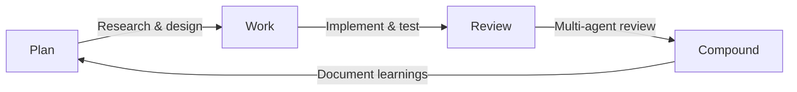

# Compound Engineering

**Parent document:** [Development REQUIREMENTS](REQUIREMENTS.md)
**Status:** Adopted from [Blueprint RX](https://github.com/tnirpeulb/rx); experimental and evolving
**Last Updated:** 2026-08-22

**Compound Engineering** is a methodology from [Every](https://every.to/guides/compound-engineering) where every unit of work makes the next one easier. Instead of treating AI as autocomplete, you build a flywheel: agents, humans, and accumulated knowledge reinforce each other, so the system gets faster and smarter each cycle. It is implemented here with the [compound-engineering-plugin](https://github.com/EveryInc/compound-engineering-plugin).

The pattern breaks the "faster typing" plateau by **codifying solutions** (never solved twice), **structuring agent review** (catches what humans skim past), and **building feedback loops** (the system improves every cycle).

It fits this project unusually well. A deterministic simulation produces reproducible failures ([ADR-002](../decisions/ADR-002-fixed-timestep-determinism.md)), and a reproducible failure is a documentable one — a desync caught in CI arrives as a replay file, a tick number, and a named subsystem. That is the ideal input to a compounding knowledge base.

---

## The Loop

Every feature, fix, and refactor follows the same four phases. Skipping one doesn't save time — it creates debt that slows future cycles.

| Phase | Skill | Purpose |
|-------|-------|---------|
| **Plan** | `ce-plan` | Research the problem, check `docs/solutions/` and existing patterns, produce an approved plan before writing code |
| **Work** | `ce-work` | Execute the approved plan step by step, writing tests; the build, lint, and test gates in [Development §9](REQUIREMENTS.md#9-enforcement-summary) must pass |
| **Review** | `ce-code-review` | Run the multi-agent review to catch issues across dimensions before human review |
| **Compound** | `ce-compound` | Document the solution in `docs/solutions/` so the next cycle starts from a higher baseline |

Use `ce-brainstorm` upstream when requirements are unclear or several approaches are viable. When brainstorming settles a question between competing architectures, the output is an [ADR](../decisions/README.md), not a solution document — see §4.

---

## Review Personas

`ce-code-review` does not run a fixed panel. It selects a **risk-driven roster** per diff from the skill's own persona catalog: `correctness` and `project-standards` always run, and the rest are selected by what the diff touches — `security`, `performance`, `api-contract`, `reliability`, `testing`, `maintainability`, `adversarial`, `learnings-researcher`, `previous-comments`, and others. Read the catalog for the exact selection rule; do not memorise a panel, because the roster is a function of the diff.

Two dimensions matter more here than the catalog's defaults assume, and a reviewer should reach for them explicitly:

- **Determinism.** Any diff touching `src/engine/sim/`, `src/engine/net/`, or any simulation system gets read against the [determinism contract](../engine/REQUIREMENTS.md#43-determinism-contract): no wall-clock reads, no unordered iteration, no casual SIMD, no unnamed RNG. A violation here is not a code-quality note — it halts co-op sessions ([ADR-005](../decisions/ADR-005-deterministic-lockstep-coop.md)).
- **Budget.** Any diff adding per-entity or per-projectile work gets read against the [frame budget](../engine/REQUIREMENTS.md#7-non-functional-requirements). At 22,000 entities, an innocuous-looking addition inside a tick loop is a shipping-blocker, and CI's performance gate will find it later and more expensively.

---

## Review Lanes

Contributions travel one of two lanes. The lane is decided by the paths a change touches — not by who, or what, authored the code.

| Lane | Trigger | Review rule |
|------|---------|-------------|
| **Red** | Touches any red-lane path below | Designated-owner review required |
| **Normal** | Everything else | Standard review |

Two rules hold in both lanes:

- **The committer owns the code, regardless of authorship.** AI-generated, pair-written, copied — if you merge it, it's yours.
- **AI review is advisory.** Automated reviewers surface issues; they never satisfy a review requirement.

### What Makes a Path Red

| Category | Paths | Why it's red |
|---|---|---|
| **Simulation core** | `src/engine/sim/`, `src/engine/net/`, `src/engine/spatial/`, `src/game/director/` | These decide state for every entity in every session. A silent bug here desyncs co-op, corrupts replays, and invalidates the debugging tool the whole project leans on |
| **RHI backends** | `src/engine/render/backends/` | Five backends, each exercised on one platform. A bug reaches only the users on that platform, and only in the field |
| **Guardrail machinery** | `cmake/`, `.clang-tidy`, `.clang-format`, `.github/workflows/`, the performance-gate baselines | Weakening a check is invisible in a diff and disables enforcement everywhere |
| **Specification** | `REQUIREMENTS.md`, `docs/*/REQUIREMENTS.md`, `docs/decisions/`, `docs/development/design-principles.md` | These are what review is conducted *against*. Changing the standard is a bigger act than changing code that fails it |

The fourth category surprises people: **editing a requirements document or an ADR is a red-lane change.** It is not a "docs change" for review purposes.

> This repository is not yet under version control. Once it is, the red-lane paths belong in `.github/CODEOWNERS` with a one-line reason per entry, and that file becomes the single source of truth — a copy of the globs in this page is a list that drifts.

---

## What to Compound

Not everything needs a write-up. The test: **would this save someone 30+ minutes if they hit it again?**

| Worth documenting | Skip |
|-------------------|------|
| A cross-platform float divergence and what fixed it | Routine gameplay tuning |
| An RHI backend behaving differently from the other four | Straightforward bug fixes |
| A tick-order dependency that wasn't obvious | Adding a weapon definition |
| A performance fix with before/after numbers | Config and dependency bumps |
| A CMake or toolchain trap that cost an afternoon | Standard test additions |
| A desync root cause and the invariant that now prevents it | — |

Document in [`docs/solutions/`](../solutions/README.md) using the template there. Tag with terms this project actually searches on — `determinism`, `rhi`, `metal`, `vulkan`, `dx12`, `cmake`, `lockstep`, `spatial-hash`, `sprite-depth`, `budget`. Periodically extract recurring patterns up into the requirements documents or an ADR: a solution that keeps recurring is a missing rule, not a missing note.

### Solutions vs. ADRs vs. Requirements

Three places to write things down, and the distinction matters:

| Write it in | When |
|---|---|
| `docs/solutions/` | You solved a specific problem and the next person hitting it should not start from zero. Retrospective, narrow, dated |
| `docs/decisions/` | You chose between viable architectural approaches. Prospective, binding, cites [design principles](design-principles.md) |
| `docs/*/REQUIREMENTS.md` | The choice changes what must be true about the system. Normative |

A solution document that starts prescribing how everyone must write code has outgrown its directory — promote it.

---

## Setup

The plugin is enabled in `.claude/settings.json`, the only settings file that should be committed (`.claude/settings.local.json` is personal and gitignored). To verify, confirm `ce-plan`, `ce-code-review`, and `ce-compound` are available.

Repo-specific skills, when this project has them, live in `.agents/skills/` with `.claude/skills/` as a directory of symlinks pointing at them — edit the `.agents/` copy. Blueprint RX's skills were deliberately **not** copied here: they encode a TypeScript, Next.js, Prisma, and Stripe stack and carry that repo's conventions, none of which apply to a C++ game engine. The skills worth authoring for this project are its own — a determinism reviewer, an RHI backend-parity checker, a budget auditor — and they should be written against the requirements in this documentation set rather than adapted from another repo's.

## See Also

- [Every's Compound Engineering guide](https://every.to/guides/compound-engineering) · [the plugin](https://github.com/EveryInc/compound-engineering-plugin)
- [`docs/solutions/`](../solutions/README.md) — the accumulating knowledge base
- [Design principles](design-principles.md) and [ADRs](../decisions/README.md) — what review is conducted against
